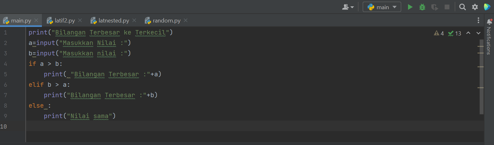
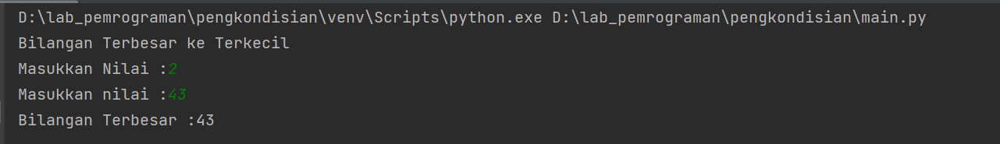
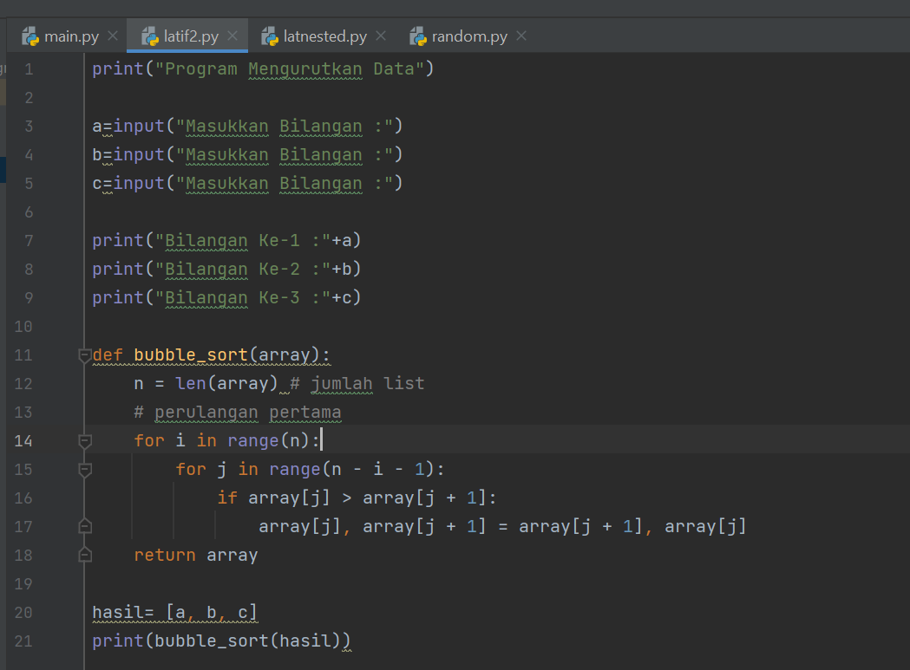
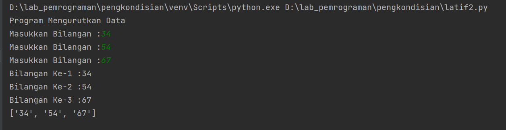
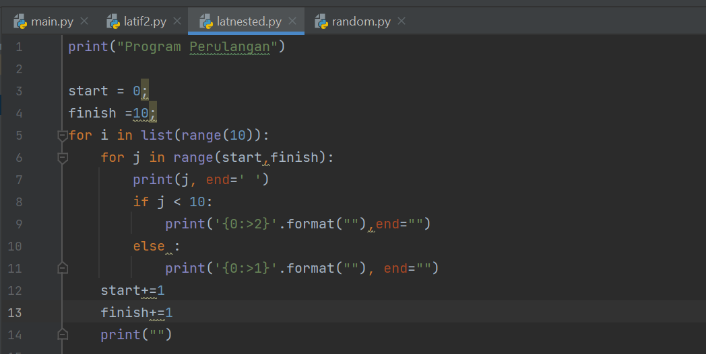
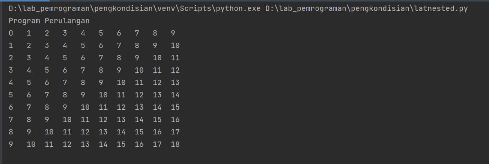
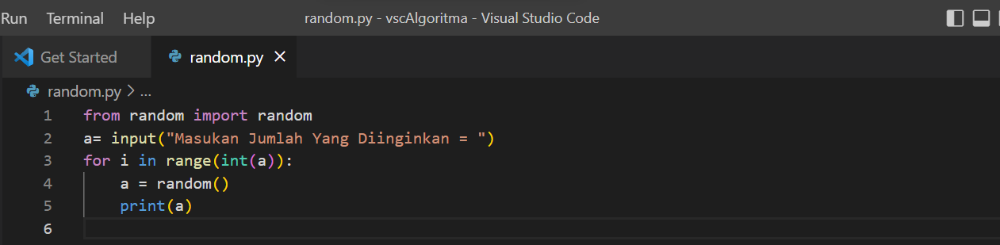
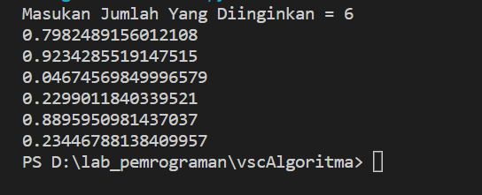

##Latihan Pengkondisian dan Perulangan

#Latihan 1

Buat program sederhana dengan input 2 buah bilangan, kemudian
tentukan bilangan terbesar dari kedua bilangan tersebut
menggunakan statement if. 

Hasil Outputnya

Penjelasan  
line 1 mencetak string "Bilangan Terbesar ke Terkecil  
line 2 Membuat input dengan a sebagai variabelnya untuk memasukkan nilai yang diinginkan  
line 3 Membuat input dengan a sebagai variabelnya untuk memasukkan nilai yang diinginkan 
line 4-9 Membuat pengkondisian dengan if, dengan logika jika a lebih dari b dan sebaliknya kemudian mencetak hasil pengkondian if dengan bilangan terbesar jika true dasn jika hasil if tersebut false maka akan mencetak string Nilai sama 

#Latihan 2

Buat program untuk mengurutkan data berdasarkan input sejumlah
data (minimal 3 variable input atau lebih), kemudian tampilkan
hasilnya secara berurutan mulai dari data terkecil. 
line 1 mencetak string "Program Mengurutkan Data" 
line 3-5 Membuat input dengan a sebagai variabelnya untuk memasukkan nilai yang diinginkan  
line 7-9 mencetak bilangan yang sudah diinputkan sebelumnya 
line 11-18 membuat logika untuk mengurutkan angka yang sudah diinputkan sebelumnya dengan menggunakan bubble sort 
line 20-21 mencetak hasil perbandingan dengan menggunakan bubble sort  

##Latihan 3

Buat program dengan perulangan bertingkat (nested) for. 

Hasil Output

Penjelasan  
Line 1 mencetak string program perulangan  
line 3 membuat variabel start untuk increment  
line 4 membuat variabel untuk finish untuk batas angka yang ingin di cetak  
line 5 membuat perulangan menggunakan for dengan range berisisikan 10 di definisikan oleh variabel i  
line 6 membuat perulangan dengan range menggunakan variabel start sampai finish di definisikan oleh variabel j  
line 7 mencetak hasil perulangan dan menambahkan 'end='' " ' agar hasil perulangan berlanjut 
Line 8-11 membuat pengkondisian dengan if  jika variabel j kurang dari 10 maka akan mencetak variabel j dengan memsberi jarak 2 dan jika j lebih dari 10 maka mencetak dengan spasi 1 
Line 12-13 membuat auto increment 

##Latihan 4

Tampilkan n bilangan acak yang lebih kecil dari 0.5.  
nilai n diisi pada saat runtime
anda bisa menggunakan kombinasi while dan for untuk
menyelesaikannya.

Hasil Output

Penjelasan  
Line 1 memanggil library random line a membuat inputan dengan a sebagai variabel nya  
line 3 membuat perulangan dengan range a sebagai integer di definisikan oleh variabel i  
line 4 mengkonversikan variabel a menjadi angka random <ny>
line 5 mencetak variabel a 
